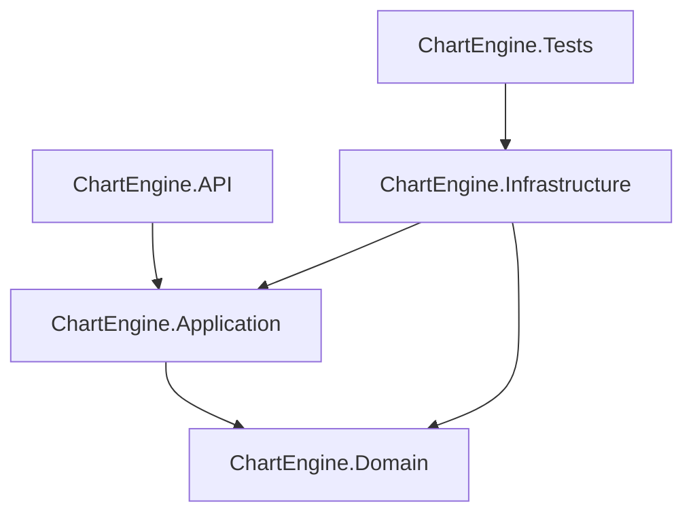
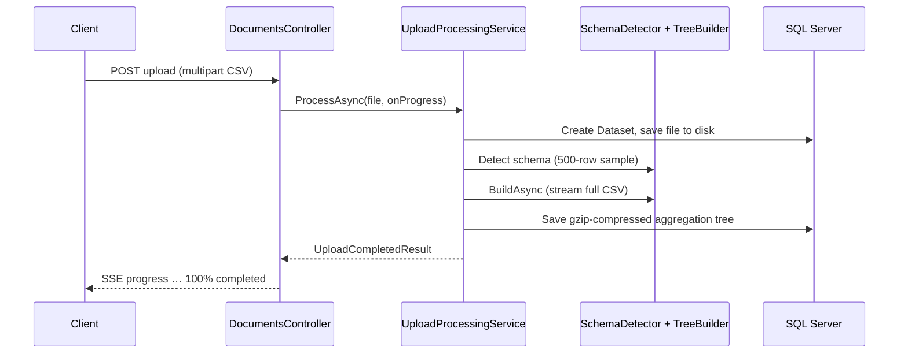
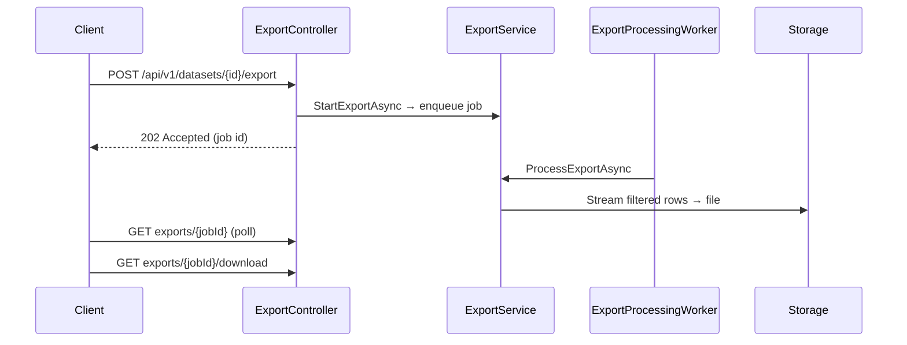

# Chart Engine Server

High-performance .NET backend for ingesting large CSV datasets, auto-detecting schema, building hierarchical aggregation trees, serving chart-ready visualizations, and running memory-efficient filtered exports.

Built as a **modular monolith** using Clean Architecture: business rules live in `Domain`, contracts in `Application`, implementations in `Infrastructure`, and HTTP in `API`.

---

## Solution structure

```
chart-engine-server/
├── ChartEngine.slnx
├── test_client.html              # Browser test client (upload SSE + chart API tests)
├── docs/                         # Architecture and feature deep-dives
├── src/
│   ├── ChartEngine.API/          # ASP.NET Core host, controllers, middleware
│   ├── ChartEngine.Application/  # DTOs, interfaces (repos, services, analytics, charts)
│   ├── ChartEngine.Domain/       # Entities, value objects, enums, exceptions
│   └── ChartEngine.Infrastructure/
│       ├── Analytics/            # SchemaDetector, TreeBuilder, DynamicConfigResolver
│       ├── BackgroundJobs/       # Export queue + worker (channel-based)
│       ├── Extensions/           # DI registration (persistence, pipelines, visualization)
│       ├── Migrations/           # EF Core SQL Server migrations
│       ├── Persistence/          # AppDbContext, repositories
│       ├── Services/             # UploadProcessingService, ExportService, Visualization
│       │   └── Visualization/Formatters/   # 10 chart formatters + registry
│       └── Storage/              # LocalFileStorage
└── tests/
    └── ChartEngine.Tests/        # xUnit tests (schema, tree, export)
```

### Layer dependencies



| Project | Role |
|---------|------|
| **ChartEngine.Domain** | `Dataset`, `ExportJob`, `AggregationTree`, `TreeNode`, `DatasetSchema`, `MetricAggs`. No external dependencies. |
| **ChartEngine.Application** | DTOs, repository/service interfaces, `IChartFormatter`, analytics contracts (`ISchemaDetector`, `ITreeBuilder`). |
| **ChartEngine.Infrastructure** | EF Core + SQL Server, file storage, analytics engines, upload/visualization/export services, export background worker. |
| **ChartEngine.API** | REST controllers, Swagger, CORS, global exception middleware, Kestrel limits (up to 2 GB uploads). |

---

## Processing pipelines

### 1. Synchronous upload (SSE)

Upload and tree building run **in the HTTP request** on `POST /api/v1/documents/upload`. Progress is streamed back as **Server-Sent Events** (not SignalR).



**`UploadProcessingService`** steps:

1. Save raw CSV via `IFileStorage`
2. Sample **500 rows** for schema detection
3. Estimate row count as `file.Length / 100` (drives `DynamicConfigResolver`: max depth, dimension cardinality)
4. Stream-build aggregation tree with `TreeBuilder`
5. Persist tree envelope `{ tree, dimensions, metrics, rejected, totalRows }` (gzip + base64 in DB)

### 2. Background export (async)

Exports use a **channel queue** and `ExportProcessingWorker` (hosted service). CSV/Excel generation streams rows with O(1) memory (MiniExcel for Excel).



---

## API reference

Base URL (development): `http://localhost:5110`

| Method | Endpoint | Description |
|--------|----------|-------------|
| `GET` | `/health` | Health check |
| `POST` | `/api/v1/documents/upload` | Upload CSV; response is `text/event-stream` (SSE) |
| `GET` | `/api/v1/documents` | Paginated dataset list (`page`, `pageSize`, `sortBy`, `search`) |
| `DELETE` | `/api/v1/documents/{id}` | Delete dataset and related DB rows |
| `GET` | `/api/v1/documents/visual` | Chart payload for a dataset |
| `POST` | `/api/v1/datasets/{datasetId}/export` | Start export job (`format`, optional `drillPath`) |
| `GET` | `/api/v1/datasets/exports/{jobId}` | Export job status |
| `GET` | `/api/v1/datasets/exports/{jobId}/download` | Download completed export |

Swagger UI: `http://localhost:5110/swagger`

### Upload SSE events

Each event is a line: `data: {json}\n\n`

| `status` | Meaning |
|----------|---------|
| `processing` | `progress` 0–99 |
| `completed` | `data`: `{ datasetId, totalRows, dimensions, metrics }` |
| `error` | `message`: error text |

### Visualization

`GET /api/v1/documents/visual`

| Query | Default | Description |
|-------|---------|-------------|
| `id` | (required) | Dataset UUID |
| `chartType` | `bar` | See supported types below |
| `drillDown` | `0` | Tree depth (0 = root; walks first child per level) |
| `aggregation` | `count` | Passed to formatters as metadata (`meta.groupedBy`) |

**Supported `chartType` values:** `bar`, `pie`, `line`, `scatter`, `bubble`, `heatmap`, `histogram`, `sunburst`, `multiline`, `correlation`. Unknown types fall back to `bar`.

**Response shape:**

```json
{
  "chartType": "bar",
  "data": [ { "name": "...", "value": 123 } ],
  "meta": { "level": 0, "nodesCount": 8, "groupedBy": "count" }
}
```

The service loads the stored tree envelope, extracts the nested `tree` node, navigates to `drillDown`, and runs the matching formatter.

### Export request body

```json
{
  "format": "CSV",
  "drillPath": [{ "column": "Country", "value": "USA" }]
}
```

`drillPath` may also be sent as a JSON string. Formats: `CSV`, `Excel`.

---

## Getting started

### Prerequisites

- [.NET 10 SDK](https://dotnet.microsoft.com/download)
- SQL Server (local or remote)
- Writable storage path for uploaded CSVs

### Configuration

1. Copy connection settings from templates:
   - `src/ChartEngine.API/appsettings.json.template` → `appsettings.json`
   - `src/ChartEngine.API/appsettings.Development.json.template` → `appsettings.Development.json` (optional)

2. Set `ConnectionStrings:Default` and `Storage:BasePath` in `appsettings.json`.

### Database

```bash
dotnet ef database update --project src/ChartEngine.Infrastructure --startup-project src/ChartEngine.API
```

### Run

```bash
dotnet run --project src/ChartEngine.API
```

API listens on **http://localhost:5110** (see `launchSettings.json`).

### Test client

Open `test_client.html` in a browser (with the API running):

1. **Upload** — select a CSV; watch SSE progress; dataset ID auto-fills when complete.
2. **Visualization** — **Run All Tests** exercises all 10 chart types against the dataset ID.

For large files (e.g. 2M rows), expect sub-minute processing when dynamic config clamps hierarchy depth and dimension cardinality based on estimated row count.

### Build and test

```bash
dotnet build --configuration Release
dotnet test --configuration Release
```

Current suite: **14 tests** (`SchemaDetectorTests`, `TreeBuilderTests`, `ExportServiceTests`).

---

## Key implementation notes

### Dynamic config (tree size control)

`DynamicConfigResolver` uses **estimated row count** (from upload: `file.Length / 100`) to set `MaxHierarchyDepth` and `MaxDimCardinality`. Underestimating row count (e.g. hardcoded `1000`) allows high-cardinality columns as dimensions and can explode tree size on multi-million-row files.

### Aggregation tree storage

`TreeRepository` serializes `{ tree, dimensions, metrics, rejected, totalRows }`, compresses with **GZip**, and stores base64 in `AggregationTrees`. `VisualizationService` must deserialize the **`tree`** property, not the wrapper root.

### Performance

- **Tree building:** index-based field access per row (avoids per-row dictionary churn on large CSVs).
- **Exports:** streaming read/filter/write; Excel via **MiniExcel** with lazy enumeration.
- **Upload limit:** Kestrel and multipart limits set to 2 GB.

---

## Documentation

| Document | Topic |
|----------|--------|
| [docs/PROJECT_OVERVIEW.md](docs/PROJECT_OVERVIEW.md) | High-level map of the repo |
| [docs/ARCHITECTURE.md](docs/ARCHITECTURE.md) | Layering, EF, migrations, dependencies |
| [docs/ARCHITECTURE_AND_FLOW.md](docs/ARCHITECTURE_AND_FLOW.md) | End-to-end request flows |
| [docs/DEEP_DIVE_DATASET_UPLOAD.md](docs/DEEP_DIVE_DATASET_UPLOAD.md) | Upload pipeline details |
| [docs/HOW_TO_GET_CHART_DATA.md](docs/HOW_TO_GET_CHART_DATA.md) | Visualization usage |
| [docs/CHART_TYPE_AND_DRILL_LEVEL.md](docs/CHART_TYPE_AND_DRILL_LEVEL.md) | Chart types and drill-down behavior |
| [docs/TRACING_GUIDE.md](docs/TRACING_GUIDE.md) | How to trace code for a feature |

---

## Technology stack

| Area | Choice |
|------|--------|
| Runtime | .NET 10 |
| API | ASP.NET Core, Swagger |
| Database | SQL Server, EF Core 10 |
| CSV | CsvHelper |
| Excel export | MiniExcel |
| Tests | xUnit |

---

## License

See repository license terms (if applicable).
