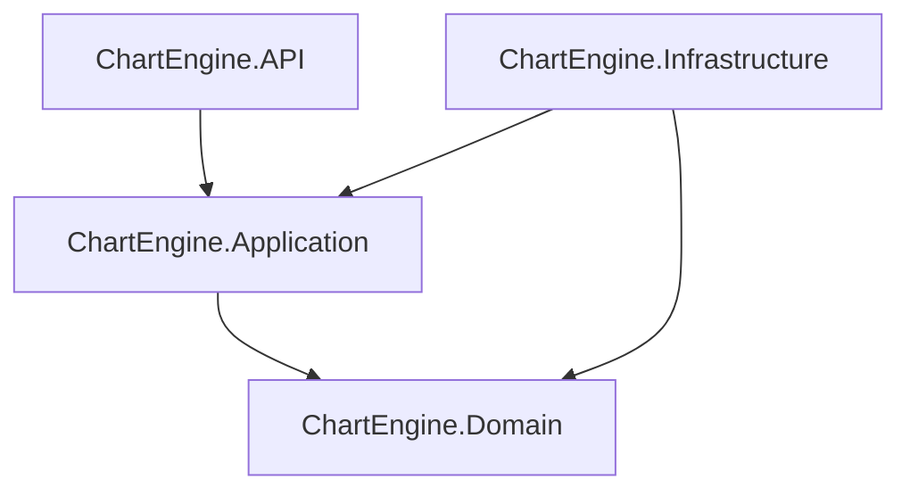
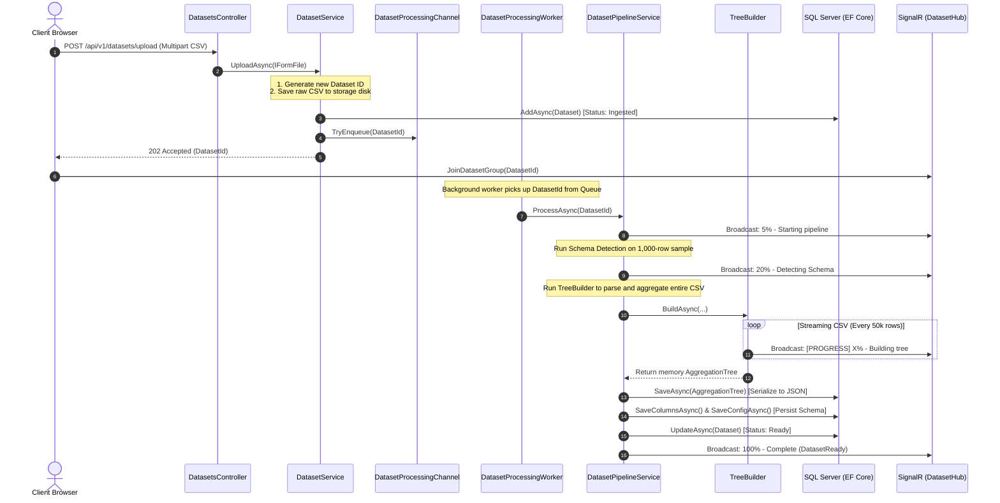
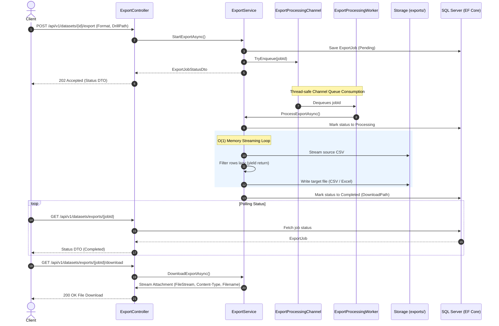

# 📊 Chart Engine Server: High-Performance Data Intelligence & Aggregation Engine

Chart Engine is a performant, Clean Architecture-based .NET backend engineered to ingest, analyze, aggregate, and export massive datasets (10M+ rows) in real-time. It completely replaces client-side CSV parsing bottlenecks by streaming raw files, performing schema auto-detection, constructing deep, multi-dimensional hierarchical aggregation trees on the server side, and running asynchronous, memory-efficient filtered exports.

---

## 🏛️ Clean Architecture Overview

The system is structured as a **Modular Monolith** using Clean Architecture principles, ensuring that core business rules are decoupled from external infrastructure, web APIs, and databases:



### 📂 Core Directory Structure

*   **`ChartEngine.Domain`**: Core enterprise business rules. Declares domain models (`Dataset`, `DatasetColumn`, `DatasetConfig`, `ExportJob`), status enums, and domain-level exceptions. Has 0 external dependencies.
*   **`ChartEngine.Application`**: Defines high-level application logic and contracts. Contains DTOs (`DatasetListDto`, `ExportJobStatusDto`, `PagedRowsDto`), repository contracts (`IDatasetRepository`, `ITreeRepository`, `IExportRepository`), and service interfaces.
*   **`ChartEngine.Infrastructure`**: Implementation details for all external services:
    *   **`Persistence`**: EF Core context (`AppDbContext`), SQL Server schema configurations, repositories, and DB migrations.
    *   **`Analytics`**: High-performance streaming engines (`TreeBuilder.cs`, `SchemaDetector.cs`).
    *   **`BackgroundJobs`**: Non-blocking channel-based worker queues for dataset parsing (`DatasetProcessingWorker.cs`) and async spreadsheet exporting (`ExportProcessingWorker.cs`).
*   **`ChartEngine.API`**: Exposes the RESTful API endpoints, handles file streaming limits, configures Swagger, SignalR hub routing, and CORS policies.

---

## 🚀 Architectural Execution Pipelines

The backend features two decoupled, high-performance background pipelines that handle long-running data operations asynchronously.

### 1. Ingestion, Schema Detection & Tree Building Pipeline



### 2. Decoupled Asynchronous Server-Side Export Pipeline



---

## ⚡ Core API Capabilities

The backend exposes a highly optimized suite of endpoints designed to handle all aspects of dataset management, exploration, and exporting:

### 📥 1. Dataset Ingestion & Aggregation
*   `POST /api/v1/datasets/upload` — Streams a raw multipart CSV file directly to disk, registers it in the DB as `Ingested`, and queues it.
*   `GET /api/v1/datasets/{id}/status` — Returns the current processing state of the ingestion pipeline.
*   `GET /api/v1/datasets/{id}/schema` — Returns the auto-detected columns, roles (Dimension or Metric), and metadata.
*   `GET /api/v1/datasets/{id}/tree` — Returns the completed serialized hierarchical aggregation tree (aggregating sum, count, min, max, avg at every level).
*   `GET /api/v1/datasets/{id}/drill?path=USA,California` — Lazy-loads children of the aggregation tree dynamically based on a path, avoiding loading massive JSON objects into memory.

### 📋 2. Dataset Management
*   `GET /api/v1/datasets` — Exposes a paginated dataset catalog.
    *   **Parameters**: `page` (default: 1), `pageSize` (default: 10), `sortBy` (`createdAt` descending or `fileName` ascending), and `search` (case-insensitive file name matching).
*   `DELETE /api/v1/datasets/{id}` — Gracefully deletes the physical source CSV file and invokes database cascade deletion across all child records (`dbo.DatasetColumns`, `dbo.DatasetConfigs`, `dbo.AggregationTrees`, and `dbo.ExportJobs`).

### 🔍 3. Paginated Raw Row Access
*   `GET /api/v1/datasets/{id}/rows` — Provides fast paginated access to filtered raw rows matching an optional `drillPath` JSON query parameter.
    *   **Parameters**: `page`, `pageSize`, `drillPath` (JSON array of `{column, value}` objects).
    *   **Histogram Filtering**: Dynamically parses the `__hist__` prefix (e.g. `__hist__Age = [20-30]` or `(10-25]`) to stream-filter numerical ranges in $O(1)$ memory.

### 📤 4. Asynchronous Filtered Exports (CSV & Excel)
*   `POST /api/v1/datasets/{id}/export` — Triggers an export background job. Accepts format (`CSV` or `Excel`) and optional `drillPath`.
    *   **Polymorphic Request Binding**: Accepts the `drillPath` filter either as a escaped JSON string or as a rich, nested JSON array directly in the request body.
*   `GET /api/v1/datasets/exports/{jobId}` — Polls the state of the export job (`Pending` -> `Processing` -> `Completed`/`Failed`).
*   `GET /api/v1/datasets/exports/{jobId}/download` — Streams the generated `.csv` or `.xlsx` spreadsheet back to the client using a optimized 64KB internal buffer.

---

## 🛠️ Performance Engineering & Memory Optimizations

During our scalability validation phases, the server went through comprehensive engineering to ensure enterprise readiness:

### 🚀 1. 10x Aggregation Speedup (Tree Building)
*   **The Problem:** Allocating separate dictionaries for each column on every single row in a 2M-row CSV triggered intense Garbage Collection (GC) pauses, causing the ingestion to take over 10 minutes.
*   **The Optimization:** Replaced dictionary lookups with pre-resolved index maps resolved once on headers. Row values are pulled directly by integer field indices in the streaming loop. Garbage collection allocations dropped to negligible levels, pushing execution times under **44 seconds** for a 2,000,000-row file.

### 💾 2. Absolute $O(1)$ Memory Footprint for Exports
*   **The Problem:** Generating files or Excel sheets for large datasets by holding rows in-memory causes the backend to run out of memory (OOM) and crash under heavy concurrent use.
*   **The Optimization:** 
    *   **CSV Writing:** Uses a streaming loop that reads rows from disk using a `64KB` buffer, immediately evaluates filters, and writes matching records out to the export file synchronously.
    *   **Excel Writing:** Utilizes the lightweight, ultra-performant **`MiniExcel`** engine paired with a custom C# `yield return` lazy generator. MiniExcel pulls records one-by-one from the enumerator as it compiles the openXML layout, securing a flat $O(1)$ memory graph regardless of dataset size.

### 🗑️ 3. Full Cascade Deletion Integration
*   Designed explicit cascade foreign key mappings on all child entities in `AppDbContext.cs`. Removing a dataset automatically triggers database triggers to clean up its schemas, aggregates, and export logs atomically, keeping the database in a perfect state.

---

## 🧪 Automated Testing Suite

The codebase has robust test coverage ensuring that logic changes do not break filtering, aggregation, or background processing rules.

### Running the Tests:
Run the xUnit test suite from the repository root:
```bash
dotnet test
```

### Coverage Highlights:
1.  **Row Query & Range Parsing**: Verifies inclusive `[ ]`, exclusive `( )`, hyphenated, and custom-separated numerical boundary ranges for histogram queries.
2.  **Export Scheduling**: Asserts that `StartExportAsync` saves correct DB states and enqueues jobs in background channels.
3.  **Spreadsheet Generation**: Verifies that both CSV and Excel writers produce fully populated, properly filtered files matching header formats.
4.  **Download Guardrails**: Validates that downloading files before processing finishes throws appropriate operational exceptions.

---

## 🗺️ Scalability Roadmap

1.  **Gzip Compression**: Enable transparent Gzip compression on `AggregationTrees` in the database to shrink the storage footprint of deep hierarchical aggregates by up to 95%.
2.  **Job Cancellation**: Support manual job cancellation tokens from the frontend, allowing users to stop massive exports while running in background threads.
3.  **Distributed Queues**: For horizontal scaling across multiple web instances, transition the in-memory `System.Threading.Channels` queue to a persistent broker like **RabbitMQ** or **Azure Service Bus**.
