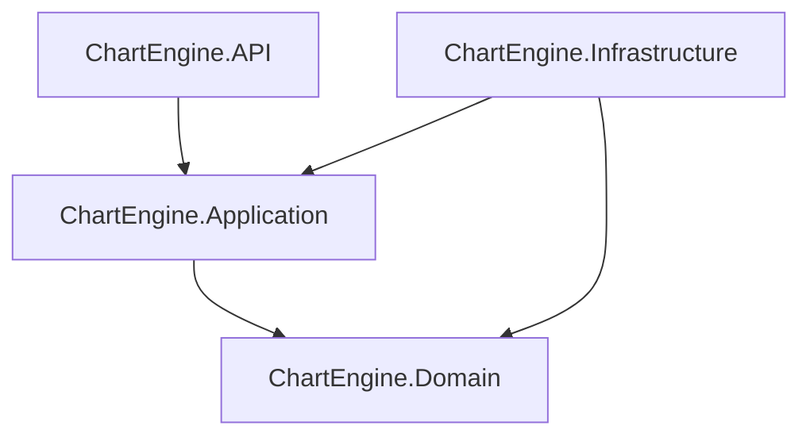
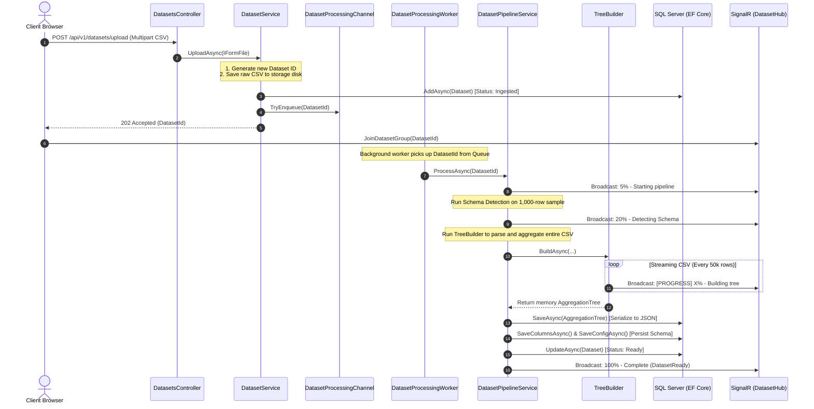

# 📊 Chart Engine Server: High-Performance Data intelligence & Aggregation Engine

Chart Engine is a performant, Clean Architecture-based .NET backend engineered to ingest, analyze, and aggregate massive datasets (10M+ rows) in real-time. It completely replaces client-side CSV parsing bottlenecks by streaming, analyzing schemas, and constructing deep, multi-dimensional hierarchical aggregation trees on the server side, persisting metadata directly to SQL Server.

---

## 🏛️ Clean Architecture Overview

The system is structured as a **Modular Monolith** using Clean Architecture principles, ensuring that business logic is completely isolated from framework and database implementations:

### 📂 Core Directory Structure

*   **`ChartEngine.Domain`**: Contains pure enterprise business objects: Entities (`Dataset`, `DatasetColumn`, `DatasetConfig`), Enums (`ColumnRole`, `DatasetStatus`), and core domain exceptions. No external dependencies.
*   **`ChartEngine.Application`**: Defines the use-cases and abstractions: DTOs, service interfaces (`IDatasetService`), repository contracts (`IDatasetRepository`, `ITreeRepository`), and SignalR Hubs.
*   **`ChartEngine.Infrastructure`**: Handles external systems: 
    *   **`Persistence`**: EF Core context (`AppDbContext`), repositories, migrations, and SQL Server interactions.
    *   **`Analytics`**: High-performance CSV streaming engine (`TreeBuilder.cs`, `SchemaDetector.cs`).
    *   **`BackgroundJobs`**: Non-blocking channel-based processing queue (`DatasetProcessingWorker.cs`).
*   **`ChartEngine.API`**: Exposes the REST API, manages Kestrel upload size configurations, SignalR hub routing, and CORS policies.

---

## 🚀 Step-by-Step Execution Flow & Function Tracing

Here is the exact end-to-end trace of how a dataset travels through the pipeline, from the moment a client clicks **Upload Dataset** to when the data becomes ready for visual rendering:

---

### Detailed Code Walkthrough (Function Tracing)

#### 1️⃣ Ingestion & Queueing
1.  **`DatasetsController.UploadAsync`** receives the multipart form file upload. It enforces Kestrel limits (`MaxRequestBodySize` up to 2GB) and delegates to `DatasetService`.
2.  **`DatasetService.UploadAsync`**:
    *   Generates a new `Guid datasetId`.
    *   Saves the raw stream to the local file system (e.g., `C:\ChartEngineStorage\datasetId.csv`) via `FileStorage.SaveAsync`.
    *   Adds a record to `dbo.Datasets` with `Status = DatasetStatus.Ingested`.
    *   Pushes the `datasetId` into a non-blocking queue (`DatasetProcessingChannel.TryEnqueue`).
    *   Instantly returns `202 Accepted` to the client along with the `datasetId`.

#### 2️⃣ Background Thread Execution
3.  **`DatasetProcessingWorker.ExecuteAsync`** is a long-running .NET `BackgroundService` that suspends until a new `datasetId` is written to the Channel. Once written:
    *   Creates a fresh dependency injection lifetime scope (`_scopeFactory.CreateAsyncScope()`) to keep `AppDbContext` scoped correctly.
    *   Fetches the `IDatasetPipelineService` and calls `ProcessAsync(datasetId, stoppingToken)`.

#### 3️⃣ Schema Detection (Sample Analysis)
4.  **`DatasetPipelineService.ProcessAsync`** sets status to `Processing` and runs schema analysis:
    *   Calls `SchemaDetector.DetectSchemaAsync()`, which streams a maximum of 1,000 sample rows from the CSV.
    *   Automatically parses columns into **Dimensions** (categories, strings) or **Metrics** (numeric columns).
    *   Rejects columns that violate constraints (e.g., uniqueness columns like `Employee_ID` which have too many unique values and are useless for aggregation).

#### 4️⃣ High-Performance Aggregation Tree Building
5.  **`TreeBuilder.BuildAsync`** runs the hot path responsible for processing the entire multi-million row file:
    *   **Index-Resolution (Done Once):** Resolves the exact column indices of dimensions and metrics inside the CSV headers. String lookup maps are completely avoided inside the loop.
    *   **The Streaming Loop:** Iterates through all rows using a high-buffer (64KB) `StreamReader` wrapped around `CsvReader`.
    *   **`AddRowToTree`** takes the row values:
        *   Walks down the tree hierarchy based on the dimension values. If a node does not exist in `ChildrenMap`, it is created.
        *   **`UpdateAggregations`**: Accumulates metric metrics at every level (sum, count, min, max, avg) using in-memory struct calculations inside `MetricAggs`.
    *   **SignalR Progress Reporting:** Every 50,000 rows, it calculates the underlying file byte position and sends throttle-controlled progress broadcasts.

#### 5️⃣ DB Serialization & Completion
6.  **`TreeRepository.SaveAsync`**: Serializes the finalized tree structure to JSON (compressing it by clearing temporary builder maps) and writes it into `dbo.AggregationTrees.TreeJson`.
7.  **`DatasetPipelineService.PersistSchemaAsync`**: Maps detected sample columns into `DatasetColumn` entities and writes them to `dbo.DatasetColumns` and `dbo.DatasetConfigs` tables.
8.  The dataset status in `dbo.Datasets` is updated to `Ready`, and a `DatasetReady` packet containing the available dimensions/metrics is broadcasted via SignalR.

---

## 🛠️ Optimizations & Completed Fixes

During the performance engineering phase, we identified and resolved three core system bottlenecks:

### 🚀 1. 10x Processing Speedup (~10 mins down to 44 seconds)
*   **The Bottleneck:** Previously, `TreeBuilder.cs` allocated a `Dictionary<string, string>` containing every single column *for every single row* (allocating 2,000,000+ dictionaries in memory). This triggered severe Garbage Collection (GC) pauses.
*   **The Fix:** Switched to index-mapped arrays (`dimValues`, `metricValues`) allocated once at startup. We bypass string lookups completely by reading columns directly by their integer column index inside `csv.GetField(index)`. 

### 🪲 2. Entity Framework Shadow Property Bug Resolved
*   **The Bottleneck:** A relationship mapping error in `AppDbContext.cs` caused EF Core to search for a phantom shadow property column `DatasetId1` inside the database, resulting in a database crash whenever `DatasetConfig` was saved.
*   **The Fix:** Corrected the 1-to-1 relationship mapping to use `.HasOne(c => c.Dataset)` which linked the existing class property, eliminating the insertion failure and restoring clean transactions.

### 📡 3. SignalR Logging Silent Blackhole Fixed
*   **The Bottleneck:** The Hub was registering groups with hyphens (e.g. `dataset-guid`), while the pipeline service pushed updates using a clean, non-hyphenated string format (`"N"` format). This meant the frontend successfully joined the group but never received a single update.
*   **The Fix:** Standardized both to use standard hyphenated string formats (`dataset-{id}`). Live logs now scroll in real-time.

---

## 🗺️ Next Steps: Scaling Roadmap

Now that the ingestion engine is lightning fast, you should implement the following scalability improvements for production:

### 1️⃣ High-Performance Drill-Down API (`GET /api/v1/datasets/{id}/drill`)
*   **Why?** Ingesting a large dataset with 8 dimensions and 12 metrics creates a massive tree. For 2,000,000 rows, the serialized database JSON is **462 Megabytes (MB)**! Streaming this massive payload at once crashes browser tabs.
*   **The Solution:** Implement the **Drill-Down (Lazy Loading)** API endpoint. Instead of requesting `GET /tree` and loading 462MB, the frontend loads the top-level branches (e.g., Root -> USA/UK) which takes 5KB. When a user clicks to expand "USA", the UI requests:
    `GET /api/v1/datasets/{id}/drill?path=USA`
    This searches the tree in the database and returns only the immediate children under USA (taking less than 2KB and loading in 2ms).

### 2️⃣ Binary Serialization / Compression
*   Implement Gzip compression on the `TreeJson` database column to compress the 462MB database payload down to <20MB, saving storage disk IO.

### 3️⃣ Frontend Visual Integration
*   Wire the React frontend dashboard service layer to fetch the columns via `GET /schema` and dynamic chart branches using `GET /drill` to complete the end-to-end user experience.
